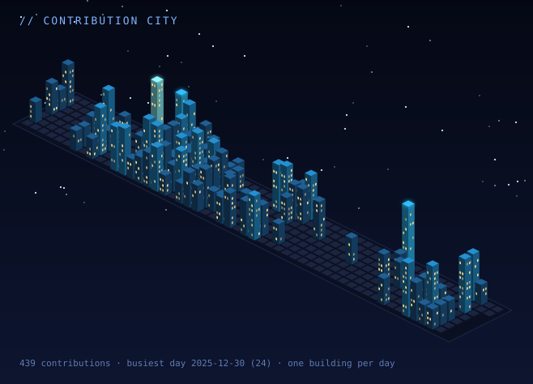



 

 

AI & ML student at **CMR University**, currently interning as an **AI Engineer at ISRO's ISTRAC** — building offline, edge-deployed systems for satellite telemetry analysis.

I work across the full stack: computer vision, retrieval-augmented generation, knowledge graphs, and time-series forecasting. I also freelance as a frontend & full-stack web developer for hospitality, F&B, and AI-agency clients.

 

---

### `// stack`

  
  
  
  
  
  
  
  
  
  
  
  
  

---

### `// projects`

| | Project | About |
|---|---|---|
| ◈ | [`GraphRAG`](https://github.com/vignesh-poovanna/GraphRAG) | RAG pipeline with knowledge graph integration for structured document retrieval |
| ◈ | [`Land Cover Segmentation`](https://github.com/vignesh-poovanna/Land-Cover-Segmentation) | Deep learning model for land classification from satellite imagery |

---

